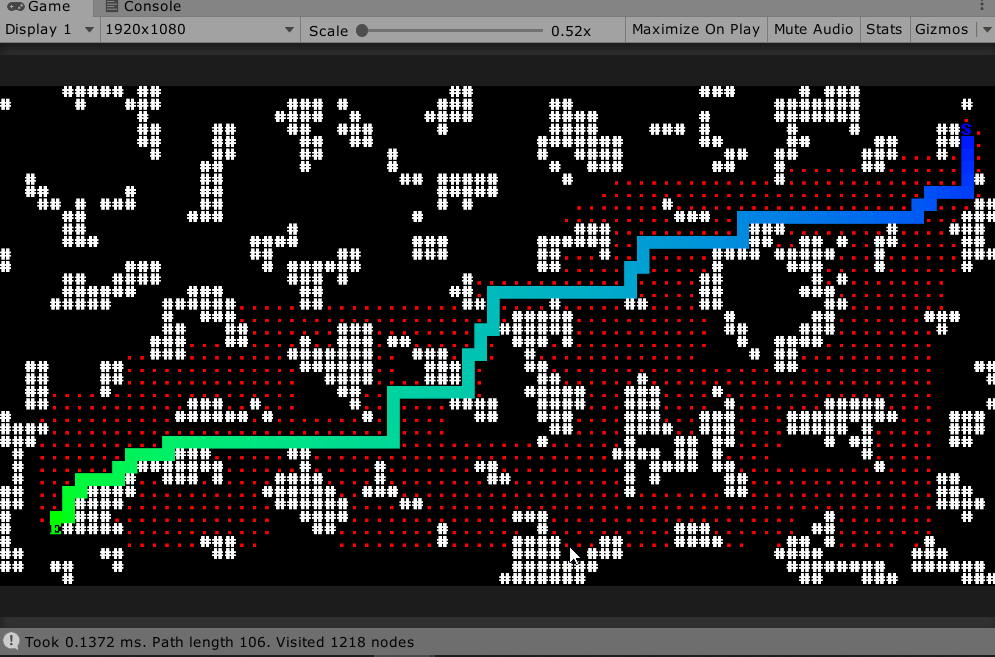

# Pathfinding

A simple generic solution for pathfinding that works in jobs and burst.


*Screenshot from the interactive demo which can be imported via the package manager UI once the package is installed.*

## How to Use

First implement your map from the `IPathingMap<T>` interface where `T` is the type representing a point on your map:

```csharp
public struct TestMap : IPathingMap<int2>
```

Then create your astar struct and pass in a nativelist which will be populated with your path:

```csharp
var map = new TestMap(100, 100);
var path = new NativeList<int2>(10, Allocator.Temp);

// Use the same generic type as your map for the AStar instance
new Astar<int2>(10, Allocator.Temp).FindPath(map, start, end, path);
```

The `AStar` instance is job and burst safe. It can be re-used which will help performance by not needing to re-allocate internal memory on every use, just make sure to call `astar.Clear()` before you do so.

## Known Issues
 - The first call to `AStar.FindPath` tends to run pretty slow, even in burst. It runs much more quickly after that.
 - Performance dips drastically on very large open maps > (1000 x 1000).

## How to Install

##### Via [OpenUPM](https://openupm.com/):
```bash
npm install -g openupm-cli
openupm add com.sark.pathfinding
```
This will automatically installed required dependencies.

##### Via the Package Manager (Install via git url...):
`https://github.com/sarkahn/pathfinding#upm`

##### Via the repo (Clone the master branch):
`https://github.com/sarkahn/pathfinding.git`